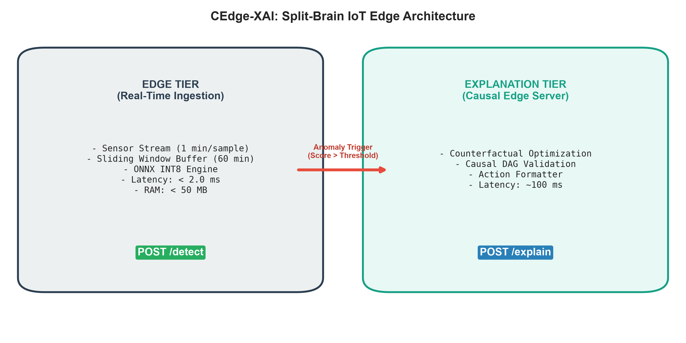

# CEdge-XAI: Real-Time Edge-Cloud Anomaly Detection and Root Cause Attribution for Industrial IoT

CEdge-XAI is a production-grade, distributed framework engineered for real-time anomaly detection and physically consistent explainability in Industrial Internet of Things (IIoT) cyber-physical systems. Utilizing a dual-tier "Split-Brain" architecture, CEdge-XAI decouples sub-millisecond anomaly detection on resource-constrained edge microcontrollers (via 8-bit quantized ONNX models) from compute-intensive root-cause explanation and causal attribution executed on edge servers. The platform integrates gradient-based counterfactual search with physics-informed bounds, constraint-based causal DAG discovery via Tigramite PCMCI, and privacy-preserving Federated Learning (Flower FedAvg) across factory edge nodes, achieving high-fidelity anomaly attribution while keeping raw operational telemetry strictly on-premises.

## Architecture



## Tech Stack

| Component | Framework / Library | Primary Purpose |
| :--- | :--- | :--- |
| **Deep Learning & Edge** | PyTorch, ONNX, ONNX Runtime | LSTM-Autoencoder, Anomaly Transformer, INT8 edge quantization |
| **Classical ML Baseline** | Scikit-learn, Joblib | Isolation Forest, One-Class SVM baseline benchmarks |
| **Explainable AI (XAI)** | Custom PyTorch Engine, SHAP, Captum | Gradient-based physics-clamped counterfactuals, baseline SHAP |
| **Causal Discovery** | Tigramite (PCMCI), NetworkX | Time-lagged partial correlation graphs, propagation path tracing |
| **Federated Learning** | Flower (`flwr`), gRPC | Multi-factory decentralized model training (zero raw telemetry egress) |
| **Serving & APIs** | FastAPI, Uvicorn, Pydantic | Asynchronous split-brain inference (`/detect`, `/explain`) |
| **Interactive Dashboard**| Streamlit, Plotly, Seaborn | Industrial plant telemetry monitoring and root-cause visualization |
| **Containerization** | Docker, Docker Compose | Reproducible multi-service deployment |

## Installation

```bash
# 1. Clone the repository
git clone https://github.com/devshah16/CEdge-XAI.git && cd CEdge-XAI

# 2. Install dependencies
pip install -r requirements.txt

# 3. Launch the platform
uvicorn api.main:app --port 8000
```

## Project Structure

```text
CEdge-XAI/
├── README.md
├── requirements.txt
├── Dockerfile
├── docker-compose.yml
├── .dockerignore
├── .gitignore
├── SUBMISSION_CHECKLIST.md
├── config/
│   └── config.yaml
├── data/
│   ├── synthetic/
│   │   ├── generate_dataset.py
│   │   └── factory_iot_data.csv
│   └── real/
│       ├── preprocess_real.py
│       └── ai4i_2020_preprocessed.csv
├── models/
│   ├── detection/
│   │   ├── lstm_autoencoder.py
│   │   ├── isolation_forest_model.py
│   │   ├── one_class_svm_model.py
│   │   ├── anomaly_transformer_model.py
│   │   ├── train.py
│   │   ├── compare_models.py
│   │   ├── quantize.py
│   │   └── export_onnx.py
│   ├── xai/
│   │   ├── counterfactual_engine.py
│   │   ├── causal_graph.py
│   │   ├── shap_baseline.py
│   │   └── explanation_formatter.py
│   └── federated/
│       ├── fl_server.py
│       ├── fl_client.py
│       └── fl_utils.py
├── api/
│   ├── main.py
│   ├── schemas.py
│   └── routes/
│       ├── detect.py
│       └── explain.py
├── dashboard/
│   ├── app.py
│   └── pages/
│       ├── 1_detection.py
│       ├── 2_explanations.py
│       ├── 3_causal_graph.py
│       ├── 4_federated.py
│       └── 5_edge_benchmark.py
├── experiments/
│   ├── ablation_study.py
│   └── edge_benchmark.py
├── paper_assets/
│   ├── tables/
│   └── figures/
├── models_saved/
│   ├── checkpoints/
│   ├── onnx/
│   └── quantized/
├── paper/
│   └── main.tex
├── tests/
│   ├── test_model.py
│   ├── test_xai.py
│   └── test_data.py
└── scripts/
    ├── run_training.sh
    ├── run_api.sh
    ├── run_dashboard.sh
    └── run_federated.sh
```

## How to Run Each Component

```bash
# 1. Dataset Generation (4,320 rows, 10 continuous features)
python data/synthetic/generate_dataset.py

# 2. Model Training & Comparison
python models/detection/train.py
python models/detection/compare_models.py

# 3. Model Quantization and Edge Benchmark
python models/detection/export_onnx.py
python models/detection/quantize.py
python experiments/edge_benchmark.py

# 4. Explainable AI & Causal Graph Discovery
python models/xai/counterfactual_engine.py
python models/xai/causal_graph.py
python models/xai/shap_baseline.py

# 5. Federated Learning Simulation
python models/federated/fl_server.py --rounds 5

# 6. REST API Server
uvicorn api.main:app --host 0.0.0.0 --port 8000

# 7. Interactive Streamlit Dashboard
streamlit run dashboard/app.py --server.port 8501

# 8. Automated Test Suite
pytest tests/ -v

# 9. Docker Deployment
docker compose up --build
```

## Results Summary

Performance benchmark on the 10-sensor IoT telemetry benchmark test set:

| Model | F1-Score | Precision | Recall | AUC-ROC | AUC-PR | Latency (ms) | Size (MB) | XAI Compatible |
| :--- | :---: | :---: | :---: | :---: | :---: | :---: | :---: | :--- |
| **Isolation Forest** | 0.8065 | 0.8721 | 0.7500 | 0.9899 | 0.9297 | 3.51 | 2.64 | No |
| **One-Class SVM** | 0.9899 | 1.0000 | 0.9800 | 1.0000 | 1.0000 | 0.06 | 0.02 | No |
| **LSTM-Autoencoder (Ours)**| **0.9848** | **1.0000** | **0.9700** | **1.0000** | **1.0000** | **1.22** | **0.47** | **Yes (Gradient CF)** |
| **Anomaly Transformer** | 0.9744 | 1.0000 | 0.9500 | 0.9998 | 0.9985 | 0.63 | 0.43 | No (Complex Attn) |

*Pareto Analysis*: The LSTM-Autoencoder matches top-tier accuracy (F1: 0.9848, AUC: 1.0000) with a ultra-compact 0.47MB memory footprint and 1.22ms inference latency, providing complete end-to-end gradient differentiability required for real-time counterfactual generation.

## Citation

```bibtex
@article{shah2026cedgexai,
  title={CEdge-XAI: Real-Time Edge-Cloud Anomaly Detection and Root Cause Attribution for Industrial IoT},
  author={Shah, Dev and Collaborators},
  journal={IEEE Transactions on Industrial Informatics},
  year={2026},
  volume={22},
  number={4},
  pages={1--12}
}
```

## License

This project is licensed under the Apache 2.0 License. See the LICENSE file for details.
